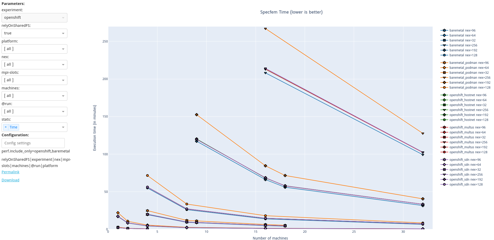

Running Specfem benchmarking
============================

Specfem3D_Globe is geophysics application that simulates earthquakes
and seismic wave propagation in the earth’s crust. Running it on
OpenShift requires the help of a Go client, to coordinate 1/ the
parallel execution of the mesher, 2/ the build of the solver, that
uses a header file generated by the solver and 3/ the execution of the
solver. The design and implementation of this Go client was described
in a previous post.

In the context of this HPC benchmarking work, we wanted to compare
Specfem performance in multiple platform setups (baremetal and
baremetal inside podman; OpenShift with SDN, `Multus` or `HostNetwork`
networking), and with multiple problem sizes (ranging from a few
minutes of execution to several hours). And as the aim of this work
was to demonstrate the scaling of the cluster, we had to run the
benchmark with different node counts. In the end, we collected more
than 180 measurements!

To automatize the execution of this heavy-weight benchmarking, we
reused a tool developed as part of another Red Hat project (see its
[presentation][matrix-bench pres] and
[repository][matrix-bench repo]). The tool takes as input a list of
parameters to [benchmark][matrix-bench bench]:

```
      platform:  baremetal, podman, openshift,
      network: default, multus, hostnet
      relyOnSharedFS: True
      extra:
        # 32 nex
        - nex=32, processes=1, mpi-slots=1 # 1 machine
        - nex=32, processes=4, mpi-slots=2 # 2 machines
        - nex=32, processes=4, mpi-slots=1 # 4 machines

        # 64 nex
        - nex=64, processes=1, mpi-slots=1 # 1 machine
        - nex=64, processes=4, mpi-slots=2 # 2 machines
        - nex=64, processes=4, mpi-slots=1 # 4 machines
        - nex=64, processes=16, mpi-slots=2 # 8 machines
        - nex=64, processes=16, mpi-slots=1 # 16 machines
        - nex=64, processes=64, mpi-slots=2 # 32 machines
```

and with the help of [some](matrix-bench python1)
[Python](matrix-bench python2) [magic](matrix-bench python3), it
executes Specfem OpenShift client or our baremetal
[execution script](matrix-bench script). At the end of the execution,
it collects final execution time from Specfem log file, and stores it
for offline processing.

```
[...]
13:32:00 running 67/72
13:32:00 > driver=None_relyOnSharedFS=True_platform=baremetal_network=default_run=scale-3_nex=192_processes=9_mpi-slots=1
13:32:00 apply_settings: relyOnSharedFS=True, platform=baremetal, network=default, run=scale-3, nex=192, processes=9, mpi-slots=1
13:32:00 clear graphs
13:32:00 Waiting for the end of the execution
.............................................
FINISHED: Specfem finished after 9151.703304007999s (=152min)
16:04:45 Timing table has 1 records.
16:04:45 save record into results/openshift/default/baremetal/relyOnSharedFS=True_platform=baremetal_network=default_run=scale-3_nex=192_processes=9_mpi-slots=1.rec
16:04:45
16:04:45 running 68/72
[...]
```

The goal of this tool is to automatize the benchmark execution and
result collection. This avoids repetitive manual interventions that
are error-prone, and it also facilitates a lot the execution of long
benchmarks that can be carried out overnight or weekends.

The tool also provides a framework for analyzing the benchmark
results. The generic part of the Web UI allows selecting the type of
plot that will be displayed, as well as the benchmark values that
should be plotted. Then some benchmark-specific plots can be designed
in Python, based on
[Plotly OpenSource engine](https://plotly.com/python/).



matrix-bench pres: https://spice-space.org/demos.html#spice-adaptive-streaming-performance-recording-and-benchmarking
matrix-bench repo: https://gitlab.com/kpouget_psap/matrix_benchmark
matrix-bench bench: https://gitlab.com/kpouget_psap/specfem-benchmarks/-/blob/master/benchmarks.yaml
matrix-bench python1: https://gitlab.com/kpouget_psap/matrix_benchmark/-/blob/work/specfem/plugins/specfem/measurement/specfemsimpleagent.py
matrix-bench python2: https://gitlab.com/kpouget_psap/matrix_benchmark/-/blob/work/specfem/plugins/specfem/measurement/specfem_openshift.py
matrix-bench python3: https://gitlab.com/kpouget_psap/matrix_benchmark/-/blob/work/specfem/plugins/specfem/measurement/specfem_baremetal.py
matrix-bench script: https://gitlab.com/kpouget_psap/matrix_benchmark/-/blob/work/specfem/plugins/specfem/scripts/build_and_run.sh
